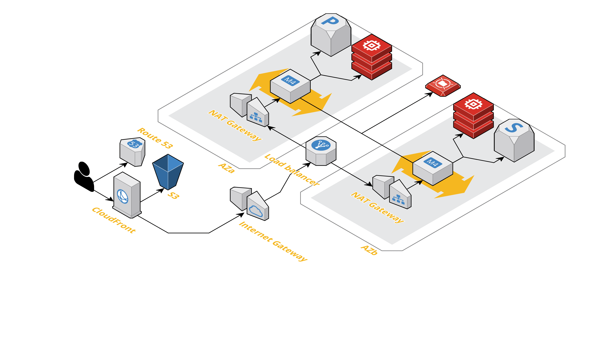

# AWS Cloudformation Drupal showroom

This repository is a showroom to create Drupal architecture reference on AWS.

## Architecture

* We use eu-central-1 (Frankfurt) as AWS region.
* To ensure architecture high availability, we use two availability zones on this region
* Database are use in "primary - stand-by" way. Please note direct link on instances and databases are not displayed on architecture diagram.

## How to use

Lorem ipsum

## References

* [Running Drupal on AWS](https://github.com/aws-samples/aws-refarch-drupal)
